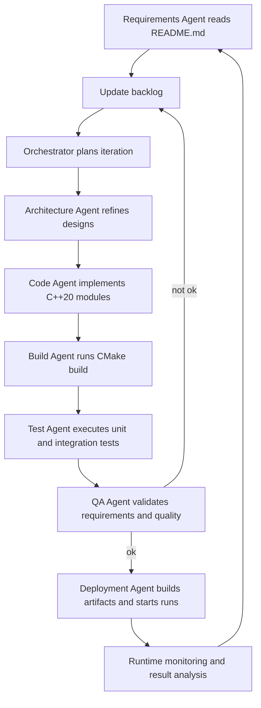

```markdown
The project description and current [`README.md`](README.md) have been evaluated. Because [`Project_Description.md`](Project_Description.md) is still empty, this plan is derived entirely from [`README.md`](README.md) and the implicit project vision.

## AI-Driven Project Plan for an Autonomous Ping Statistics System

### 1. Target Vision and Scope

The goal is a fully AI- and agent-driven system that operates without human intervention to:
- manage requirements,
- document architectural decisions,
- generate and evolve code,
- run builds and tests,
- deliver and monitor the ping statistics application.

The focus is a C++20/CMake-based ping tool that collects long-term statistics for multiple targets (latency, histograms, min/max/mean/median), runs cross-platform, and continuously provides results.

---

### 2. High-Level Architecture of the AI Agent System

The overall system is logically composed of the following components:

1. **Orchestrator Agent**
   - Drives the end-to-end process.
   - Plans iterations, prioritizes tasks, coordinates specialized agents.
   - Maintains project state (backlog, current versions, quality metrics).

2. **Requirements and Knowledge Agent**
   - Extracts and updates requirements from documents (e.g., [`README.md`](README.md), and future specifications).
   - Maintains a consistent, versioned knowledge base (goals, constraints, platform requirements).

3. **Architecture Agent**
   - Designs and evolves the software architecture of the C++ project.
   - Defines modules such as [`PingSession`](src/ping_session.hpp:1), [`StatisticsAggregator`](src/statistics_aggregator.hpp:1), [`ConsoleView`](src/console_view.hpp:1), [`PlatformPingBackend`](src/platform_ping_backend.hpp:1), [`TargetConfig`](src/config.hpp:1).
   - Maintains architecture documentation (e.g., `docs/architecture.md`).

4. **Code Generation Agent**
   - Creates and updates C++20 source code, CMake configuration, and helper scripts.
   - Adheres to architectural guidance and coding standards.

5. **Build and Test Agent**
   - Runs CMake configuration, builds, and tests.
   - Analyzes compiler and test failures and feeds back to the Code and Architecture agents.

6. **QA and Metrics Agent**
   - Evaluates code quality, test coverage, and functional completeness.
   - Verifies that implemented features align with the requirements in [`README.md`](README.md).

7. **Deployment and Runtime Agent**
   - Packages runnable artifacts (e.g., binaries for Linux/macOS/Windows-MinGW/Cygwin).
   - Starts monitored runs of the ping program (test environments).
   - Aggregates runtime data to validate the long-term statistics functionality.

---

### 3. Iterative Process Model (Agent Loop)

Each iteration follows a fixed, fully agent-driven cycle:

1. **Synchronization and Requirements Alignment**
   - Requirements Agent reads [`README.md`](README.md), future specification files, and the existing codebase.
   - Compares planned features (e.g., histogram, time series, min/max/mean/median, multi-target) with the current state.
   - Updates a machine-readable backlog (e.g., `plans/backlog.json`).

2. **Planning by the Orchestrator Agent**
   - Selects a meaningful increment (e.g., "basic ICMP ping for one target", "statistics aggregator for min/max/mean/median", "histogram output", "multi-target support").
   - Breaks it down into concrete tasks for the Code, Architecture, Build, and QA agents.

3. **Architecture Refinement**
   - Architecture Agent creates or updates designs, e.g., interfaces of [`PingSession`](src/ping_session.hpp:1) and [`StatisticsAggregator`](src/statistics_aggregator.hpp:1).
   - Output: updated architecture documents and any required interface headers.

4. **Code Generation and Modification**
   - Code Agent creates or modifies C++ source and CMake files:
     - Core components: [`PingSession`](src/ping_session.hpp:1), [`StatisticsAggregator`](src/statistics_aggregator.hpp:1), [`TargetConfig`](src/config.hpp:1), [`ConsoleView`](src/console_view.hpp:1), [`PlatformPingBackend`](src/platform_ping_backend.hpp:1), [`main`](src/main.cpp:1).
     - Platform abstraction for Linux/macOS/WSL/Cygwin/MinGW.
     - Statistics computation (min/max/mean/median, histogram buckets, time-series buffers).

5. **Build and Test**
   - Build Agent runs CMake configuration and build steps (per the commands in [`README.md`](README.md), lines 63–97).
   - Executes automated tests (unit tests, integration tests, possibly simulated pings).
   - Collects errors/warnings and feeds them back to the Code/Architecture agents.

6. **Quality Assurance**
   - QA Agent verifies:
     - Functional requirements are met (e.g., correct median computation, meaningful histograms, continuous updates).
     - Compliance with coding guidelines and portability expectations.
     - Consistency between behavior and the documentation in [`README.md`](README.md).

7. **Deployment and Runtime Validation**
   - Deployment Agent runs the built program with sample configurations (e.g., multiple targets, various intervals, CSV/JSON output).
   - Analyzes the resulting statistics and console output.
   - Compares against the example outputs in [`README.md`](README.md).

8. **Feedback and Knowledge Update**
   - Test and runtime results feed back into the knowledge base.
   - Backlog is adjusted and the next iteration reprioritized.

---

### 4. Functional Scope of the Target System (AI Agent Perspective)

Agents should incrementally deliver and harden the following functional goals:

1. **ICMP Ping Baseline Layer**
   - Robust sending of ICMP packets for one target per process.
   - Measurement of round-trip time (RTT) per response.
   - Error and timeout handling.

2. **Multi-Target Support**
   - Manage multiple targets via [`TargetConfig`](src/config.hpp:1) instances.
   - Parallel pings (threads or asynchronous tasks).

3. **Statistics Module**
   - Per-target aggregation in [`StatisticsAggregator`](src/statistics_aggregator.hpp:1):
     - min/max/mean/median,
     - packet counts, packet loss,
     - time-series buffer (e.g., last N measurements),
     - histogram buckets (configurable boundaries).

4. **Console Rendering**
   - Tabular display as in [`README.md`](README.md), lines 161–171.
   - Text-based time-series graph and histogram output as in lines 173–193.
   - Periodic updates without excessive scrolling (e.g., terminal clear/redraw approach).

5. **Persistence and Export**
   - Export statistics to CSV and JSON per the example invocations (lines 145–155).
   - Optional future monitoring integration (Prometheus, web UI) is considered but not core to the first increment.

6. **Platform Portability**
   - Ensure buildability and runtime on Linux, macOS, WSL, Cygwin, MinGW.
   - Abstract OS-specific differences in [`PlatformPingBackend`](src/platform_ping_backend.hpp:1).

---

### 5. Concrete Agent Backlog (No Human Steps Required)

The following prioritized backlog can be executed directly by AI agents. Each item is phrased for autonomous execution.

1. **Project Skeleton and Infrastructure**
   - Create a CMake project skeleton with target binary `pingstats`.
   - Set up base directories: `src/`, `include/`, `tests/`, `docs/`, `plans/`.
   - Create a base [`main`](src/main.cpp:1) file with a CLI parsing skeleton.

2. **Architecture Definition and Documentation**
   - Define interfaces for [`PingSession`](src/ping_session.hpp:1), [`StatisticsAggregator`](src/statistics_aggregator.hpp:1), [`ConsoleView`](src/console_view.hpp:1), [`TargetConfig`](src/config.hpp:1), [`PlatformPingBackend`](src/platform_ping_backend.hpp:1).
   - Document them in `docs/architecture.md` with textual descriptions and optional ASCII diagrams.

3. **Implement ICMP Ping Baseline**
   - Implement [`PlatformPingBackend`](src/platform_ping_backend.hpp:1) with platform-specific subclasses.
   - Ensure at least Linux and macOS variants are functional; WSL/Cygwin/MinGW build via their toolchains.

4. **Implement [`PingSession`](src/ping_session.hpp:1)**
   - Implement periodic pinging of a target with a configurable interval.
   - Emit events/records with measurements (RTT, success/failure) for [`StatisticsAggregator`](src/statistics_aggregator.hpp:1).

5. **Implement [`StatisticsAggregator`](src/statistics_aggregator.hpp:1)**
   - Compute min/max/mean/median.
   - Implement histogram bucket logic.
   - Implement a time-series buffer for the last N values.

6. **Implement [`ConsoleView`](src/console_view.hpp:1)**
   - Implement table, time-series, and histogram output matching the examples in [`README.md`](README.md).
   - Refresh output periodically without excessive scrolling.

7. **CLI Features in [`main`](src/main.cpp:1)**
   - Parse command-line arguments:
     - targets (IPs/hostnames),
     - interval option (`-i`),
     - output format (`--output-format`),
     - output file (`--output-file`).
   - Create corresponding [`TargetConfig`](src/config.hpp:1) instances and start the relevant [`PingSession`](src/ping_session.hpp:1) objects.

8. **Export Features**
   - Implement CSV and JSON export of statistics.
   - Integrate export triggers (e.g., periodic or on program termination).

9. **Test and Validation Suite**
   - Create unit tests for statistics computations (min/max/mean/median, histograms).
   - Create integration tests that ping controlled or simulated targets.
   - Automate test runs within the Build Agent.

10. **Quality Assurance and Portability Checks**
    - Have the QA Agent run the resulting binaries against the usage patterns in [`README.md`](README.md).
    - Verify that output formats (console, CSV, JSON) match the documentation.

11. **Deployment Automation**
    - Create scripts/workflows to build and package binaries for multiple platforms.
    - Create a minimal, agent-readable release notes structure.

---

### 6. Example Agent Workflow (Mermaid)



---

### 7. Handover to Implementation Mode

This plan is structured so that an AI agent system can execute the described steps without human intervention: from deriving requirements from [`README.md`](README.md), through architecture, implementation, and testing, to continuous runtime validation and iterative evolution of the ping statistics application.
```
