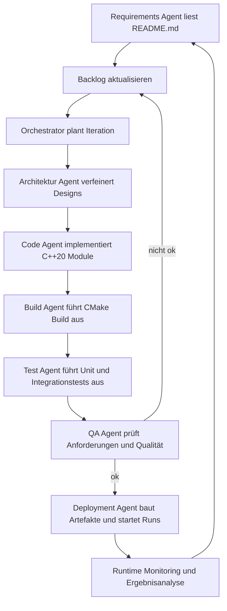

Projektbeschreibung und aktuelle [`README.md`](README.md) wurden ausgewertet. Da [`Project_Description.md`](Project_Description.md) noch leer ist, wird der Plan vollständig aus den Informationen der [`README.md`](README.md) und der impliziten Projektidee abgeleitet.

## KI-gesteuerter Projektplan für ein autonomes Ping-Statistik-System

### 1. Zielbild und Scope

Ziel ist ein vollständig KI- und agentengesteuertes System, das ohne menschliche Aktivitäten:
- Anforderungen verwaltet,
- Architekturentscheidungen dokumentiert,
- Code erzeugt und weiterentwickelt,
- Builds und Tests durchführt,
- das Ping-Statistik-Programm ausliefert und überwacht.

Der Fokus liegt auf einem C++20/CMake-basierten Ping-Tool, das Langzeitstatistiken für mehrere Ziele erhebt (Latenz, Histogramme, Min/Max/Mean/Median), plattformübergreifend lauffähig ist und kontinuierlich Ergebnisse bereitstellt.

---

### 2. High-Level Architektur des KI-Agenten-Systems

Das Gesamtsystem besteht logisch aus folgenden Komponenten:

1. **Orchestrator-Agent**
   - Steuert den End-to-End-Prozess.
   - Plant Iterationen, priorisiert Aufgaben, koordiniert spezialisierte Agenten.
   - Hält den Projektstatus (Backlog, aktuelle Versionen, Qualitätsmetriken).

2. **Requirements- und Wissens-Agent**
   - Extrahiert/aktualisiert Anforderungen aus Dokumenten (z. B. [`README.md`](README.md), später weiteren Spezifikationsdateien).
   - Pflegt eine konsistente, versionierte Wissensbasis (Ziele, Randbedingungen, Plattformanforderungen).

3. **Architektur-Agent**
   - Entwirft und aktualisiert die Softwarearchitektur des C++-Projekts.
   - Definiert Module wie [`PingSession`](src/ping_session.hpp:1), [`StatisticsAggregator`](src/statistics_aggregator.hpp:1), [`ConsoleView`](src/console_view.hpp:1), [`PlatformPingBackend`](src/platform_ping_backend.hpp:1), [`TargetConfig`](src/config.hpp:1).
   - Pflegt Architektur-Dokumentation (z. B. `docs/architecture.md`).

4. **Code-Generierungs-Agent**
   - Erzeugt und aktualisiert C++20-Quellcode, CMake-Konfiguration und Hilfsskripte.
   - Hält sich an Architekturvorgaben und Coding-Guidelines.

5. **Build- und Test-Agent**
   - Führt CMake-Konfiguration, Builds und Tests aus.
   - Analysiert Compiler- und Testfehler, erstellt Feedback für Code- und Architektur-Agent.

6. **QA- und Metrik-Agent**
   - Bewertet Codequalität, Testabdeckung und funktionale Erfüllung.
   - Überprüft, ob die implementierten Features mit den Anforderungen der [`README.md`](README.md) übereinstimmen.

7. **Deployment- und Runtime-Agent**
   - Verpackt lauffähige Artefakte (z. B. Binaries für Linux/macOS/Windows-MinGW/Cygwin).
   - Startet überwachte Läufe des Ping-Programms (Testumgebungen).
   - Aggregiert Laufzeitdaten zur Validierung der Langzeitstatistik-Funktionalität.

---

### 3. Iteratives Vorgehensmodell (Agenten-Loop)

Jede Iteration des Systems folgt einem festen Zyklus, der vollständig agentengesteuert ist:

1. **Synchronisation & Anforderungsabgleich**
   - Requirements-Agent liest [`README.md`](README.md), zukünftige Spezifikationsdateien und existierende Codebasis.
   - Abgleich geplanter Features (z. B. Histogramm, Zeitverlauf, Min/Max/Mean/Median, Multi-Target) gegen Ist-Stand.
   - Aktualisierung eines Machine-readable Backlogs (z. B. `plans/backlog.json`).

2. **Planung durch Orchestrator-Agent**
   - Auswahl eines sinnvollen Inkrements (z. B. „ICMP-Basisping für ein Ziel“, „Statistikaggregator für Min/Max/Mean/Median“, „Histogramm-Ausgabe“, „Mehrziel-Unterstützung“).
   - Zerlegung in konkrete Tasks für Code-, Architektur-, Build- und QA-Agent.

3. **Architekturverfeinerung**
   - Architektur-Agent erstellt/aktualisiert Entwürfe, z. B. Schnittstellen von [`PingSession`](src/ping_session.hpp:1) und [`StatisticsAggregator`](src/statistics_aggregator.hpp:1).
   - Output: aktualisierte Architektur-Dokumente und ggf. Interface-Dateien.

4. **Codeerzeugung und -modifikation**
   - Code-Agent erzeugt oder ändert C++-Quellcode und CMake-Dateien:
     - Kernkomponenten: [`PingSession`](src/ping_session.hpp:1), [`StatisticsAggregator`](src/statistics_aggregator.hpp:1), [`TargetConfig`](src/config.hpp:1), [`ConsoleView`](src/console_view.hpp:1), [`PlatformPingBackend`](src/platform_ping_backend.hpp:1), [`main`](src/main.cpp:1).
     - Plattformabstraktion für Linux/macOS/WSL/Cygwin/MinGW.
     - Implementierung der Statistikberechnung (Min/Max/Mittel/Median, Histogramm-Buckets, Zeitreihenpuffer).

5. **Build & Test**
   - Build-Agent führt CMake-Konfiguration und Build-Schritte aus (analog zu den Befehlen in [`README.md`](README.md), Zeilen 63–97).
   - Ausführung automatisierter Tests (Unit-Tests, Integrationstests, ggf. simulierte Pings).
   - Sammlung von Fehlern/Warnings und Rückmeldung an Code-/Architektur-Agent.

6. **Qualitätssicherung**
   - QA-Agent prüft:
     - Erfüllen der funktionalen Anforderungen (z. B. korrekte Berechnung von Median, sinnvolle Histogramme, fortlaufende Aktualisierung).
     - Einhaltung von Coding-Guidelines und Portabilität.
     - Konsistenz von Verhalten und Dokumentation in [`README.md`](README.md).

7. **Deployment & Validierung im Laufzeitbetrieb**
   - Deployment-Agent startet das gebaute Programm mit Beispielkonfigurationen (z. B. mehrere Ziele, verschiedene Intervalle, Ausgabe in CSV/JSON).
   - Analyse der real erzeugten Statistiken und Konsolen-Ausgaben.
   - Abgleich mit den in [`README.md`](README.md) beschriebenen Beispielausgaben.

8. **Rückkopplung und Wissensaktualisierung**
   - Ergebnisse der Tests und Laufzeitvalidierung fließen in die Wissensbasis.
   - Anpassung des Backlogs, Priorisierung der nächsten Iteration.

---

### 4. Fachlicher Funktionsumfang des Zielsystems (aus Sicht der KI-Agenten)

Die Agenten sollen schrittweise die folgenden funktionalen Ziele vollständig umsetzen und absichern:

1. **ICMP-Ping-Basisschicht**
   - Stabiler Versand von ICMP-Paketen für ein Ziel pro Prozess.
   - Messung der Round-Trip-Time (RTT) pro Antwort.
   - Fehler- und Timeout-Behandlung.

2. **Mehrziel-Unterstützung**
   - Verwaltung mehrerer Ziele gleichzeitig über [`TargetConfig`](src/config.hpp:1)-Instanzen.
   - Parallele Pings (Threads oder asynchrone Tasks).

3. **Statistikmodul**
   - Aggregation pro Ziel in [`StatisticsAggregator`](src/statistics_aggregator.hpp:1):
     - Min/Max/Mean/Median,
     - Paketanzahl, Paketverlust,
     - Zeitreihenpuffer (z. B. letzte N Messwerte),
     - Histogramm-Buckets (konfigurierbare Bucketgrenzen).

4. **Konsole-Rendering**
   - Tabellarische Darstellung wie in [`README.md`](README.md), Zeilen 161–171.
   - Textbasierte Zeitverlaufsgrafik und Histogramm-Ausgabe wie in Zeilen 173–193.
   - Regelmäßige Aktualisierung ohne übermäßiges Scrollen (z. B. Terminal-Clear/Redraw-Ansatz).

5. **Persistenz & Export**
   - Export von Statistiken in CSV und JSON gemäß den Beispielaufrufen (Zeilen 145–155).
   - Optional zukünftige Erweiterung für Monitoring-Integration (Prometheus, Web-UI), bereits im Plan berücksichtigt, aber nicht Kern des ersten Inkrements.

6. **Plattformportabilität**
   - Sichergestellte Kompilierbarkeit und Lauffähigkeit unter Linux, macOS, WSL, Cygwin, MinGW.
   - Abstraktion betriebssystemspezifischer Unterschiede in [`PlatformPingBackend`](src/platform_ping_backend.hpp:1).

---

### 5. Konkreter Agenten-Backlog (ohne menschliche Schritte)

Die folgenden Punkte bilden einen priorisierten Backlog, der direkt von KI-Agenten abgearbeitet werden kann. Jeder Punkt ist so formuliert, dass ein Agent ihn eigenständig umsetzen kann.

1. **Projektgrundstruktur & Infrastruktur**
   - Erzeuge CMake-Projektgrundlage mit Ziel-Binary `pingstats`.
   - Lege Basisordner an: `src/`, `include/`, `tests/`, `docs/`, `plans/`.
   - Erzeuge Basisdatei [`main`](src/main.cpp:1) mit CLI-Parsing-Skelett.

2. **Architekturdefinition und Dokumentation**
   - Definiere Schnittstellen für [`PingSession`](src/ping_session.hpp:1), [`StatisticsAggregator`](src/statistics_aggregator.hpp:1), [`ConsoleView`](src/console_view.hpp:1), [`TargetConfig`](src/config.hpp:1), [`PlatformPingBackend`](src/platform_ping_backend.hpp:1).
   - Dokumentiere diese in `docs/architecture.md` mit textuellen Beschreibungen und ggf. ASCII-Diagrammen.

3. **Implementierung ICMP-Ping-Basisschicht**
   - Implementiere [`PlatformPingBackend`](src/platform_ping_backend.hpp:1) mit plattformspezifischen Unterklassen.
   - Stelle sicher, dass mindestens Linux- und macOS-Varianten lauffähig sind; WSL/Cygwin/MinGW kompilieren über die jeweilige Toolchain.

4. **Implementierung von [`PingSession`](src/ping_session.hpp:1)**
   - Implementiere periodisches Senden von Pings an ein Ziel mit konfigurierbarem Intervall.
   - Erzeuge Events oder Strukturen mit Messwerten (RTT, Erfolg/Misserfolg) für [`StatisticsAggregator`](src/statistics_aggregator.hpp:1).

5. **Implementierung von [`StatisticsAggregator`](src/statistics_aggregator.hpp:1)**
   - Implementiere Berechnung von Min/Max/Mean/Median.
   - Implementiere Histogramm-Bucket-Logik.
   - Implementiere Zeitreihenpuffer für die letzten N Werte.

6. **Implementierung von [`ConsoleView`](src/console_view.hpp:1)**
   - Implementiere Tabellen-, Zeitreihen- und Histogramm-Ausgabe analog zu den Beispielen in [`README.md`](README.md).
   - Implementiere periodisches Rendern und aktualisiere die Ausgabe ohne übermäßiges Scrollen.

7. **CLI-Funktionen in [`main`](src/main.cpp:1)**
   - Implementiere Parsing der Kommandozeilenargumente:
     - Ziele (IPs/Hostnames),
     - Intervalloption (`-i`),
     - Ausgabeformat (`--output-format`),
     - Ausgabedatei (`--output-file`).
   - Erzeuge entsprechend [`TargetConfig`](src/config.hpp:1)-Instanzen und starte passende [`PingSession`](src/ping_session.hpp:1)-Objekte.

8. **Exportfunktionen**
   - Implementiere CSV- und JSON-Export der Statistiken.
   - Integriere Export-Trigger (z. B. periodisch oder bei Programmende).

9. **Test- und Validierungs-Suite**
   - Erzeuge Unit-Tests für Statistikberechnungen (Min/Max/Mean/Median, Histogramme).
   - Erzeuge Integrationstests, die Pings gegen kontrollierte oder simulierte Ziele ausführen.
   - Automatisiere Testläufe im Build-Agent.

10. **Qualitätssicherung & Portabilitätsprüfungen**
   - Lasse den QA-Agenten die resultierenden Binaries gegen die in [`README.md`](README.md) beschriebene Nutzung testen.
   - Prüfe, dass die Ausgabeformate (Konsole, CSV, JSON) der Dokumentation entsprechen.

11. **Deployment-Automatisierung**
   - Erzeuge Skripte/Workflows, die Binaries für verschiedene Plattformen bauen und paketieren.
   - Erzeuge eine minimale, agentenlesbare Release-Notiz-Struktur.

---

### 6. Beispielhafte Agenten-Workflow-Darstellung (Mermaid)

---

### 7. Übergabe an Implementierungsmodus

Dieser Plan ist so strukturiert, dass ein KI-Agentensystem ohne menschliche Aktivitäten die genannten Schritte sukzessive umsetzen kann: von der Anforderungsableitung aus [`README.md`](README.md) über Architektur, Implementierung und Testing bis zur kontinuierlichen Laufzeitvalidierung und Weiterentwicklung des Ping-Statistik-Programms.